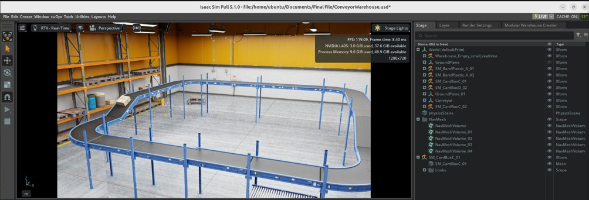
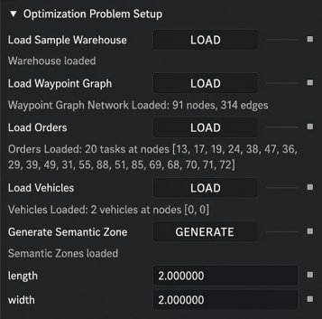
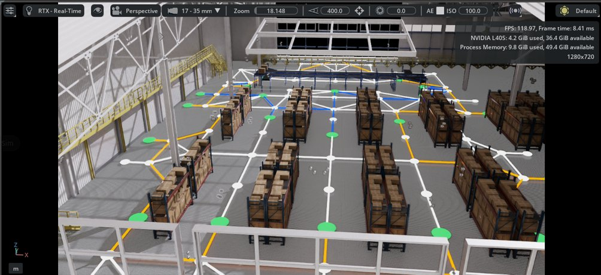
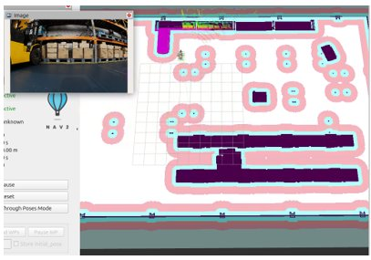

# A Blueprint-Driven Workflow to Build Customisable Warehouse Digital Twins in NVIDIA Omniverse

> A practical developer guide for building warehouse digital twins using NVIDIA Isaac Sim, ROS 2 Nav2, and NVIDIA cuOpt — without starting from scratch.

---

## Why This Repository Exists

NVIDIA Omniverse and Isaac Sim provide powerful tools for warehouse simulation. The official documentation covers each component well — the Warehouse Creator, SimReady assets, cuOpt extension, ROS 2 bridge. However, documentation on how to connect everything together into a working warehouse digital twin is limited.

This project spent 14 weeks working through that challenge — and documenting every gap, gotcha, and undocumented behaviour encountered along the way.

**This is not a finished product.** It is an honest account of what works, what does not, and what a developer needs to know before starting. If you are trying to build a warehouse digital twin in NVIDIA Omniverse, this repository will save you significant time.

---

## What This Project Did

This project did **not** build a warehouse from scratch. Instead, it built on top of what NVIDIA already provides:

- Used the **ROS 2 Nova Carter example** as the base scene
- Added **NVIDIA SimReady assets** (shelves, boxes) on top
- Integrated the **Warehouse Logistics Utilities** (conveyor system)
- Deployed **NVIDIA cuOpt** for route optimisation
- Implemented **ROS 2 Nav2** for robot navigation

The goal was to understand how these pieces connect — and document where they do not.

---

## What Was Achieved

| Component | Status | Notes |
|-----------|--------|-------|
| Warehouse scene | ✅ Working | ROS 2 Nova Carter base + SimReady assets + conveyor |
| Scalable warehouse | ✅ Working | Via Warehouse Creator extension |
| Occupancy map | ✅ Working | Generated from custom layout |
| ROS 2 Nav2 navigation | ✅ Working | Nova Carter navigating with active costmap |
| NVIDIA cuOpt routing | ✅ Working | 91-node graph, 2-vehicle solution, cost 322.69 |
| cuOpt ↔ Nav2 bridge | ❌ Not completed | No documented integration path exists — Gap G-05 |
| Full fleet simulation | ❌ Not completed | Dependent on bridge above |

---

## Project Screenshots

| | |
|--|--|
|  |  |
| Warehouse scene with conveyor and shelves | cuOpt loaded — 91 nodes, 20 tasks, 2 vehicles |
|  |  |
| cuOpt waypoint graph overlay | ROS 2 Nav2 active — Nova Carter navigating |

---

## The Honest Reality of Working With This Toolchain

Starting this project is confusing. There is no single guide that takes you from zero to a working warehouse simulation. Here is what this project learned:

**Documentation is primarily component-level.** NVIDIA provides documentation for the Warehouse Creator, the cuOpt extension, and the ROS 2 bridge individually. Documentation on how to connect them into a complete warehouse simulation workflow is limited.

**Hardware is a major blocker.** Isaac Sim requires a dedicated NVIDIA GPU. A standard laptop will not work. Cloud GPU provisioning takes time and costs money — and cloud GPU availability is not guaranteed due to global chip shortages.

**YouTube tutorials are limited.** A small number of useful videos exist but most do not go deep enough for warehouse simulation work.

**Learning by doing is unavoidable.** The prerequisite NVIDIA training courses help significantly — complete them before starting development. After that, expect to spend significant time in the NVIDIA Developer Forums and reading documentation.

**The NVIDIA Developer Forums is your most important resource** outside of the official documentation.

---

## Start Here

If you are new to this toolchain, follow this path:

| Step | Document | What it covers |
|------|----------|---------------|
| 1 | [Prerequisites](./docs/01-prerequisites.md) | Hardware requirements, software needed, accounts |
| 2 | [Environment Setup](./docs/02-environment-setup.md) | Isaac Sim + ROS 2 + cuOpt installation links and gotchas |
| 3 | [Scene Construction](./docs/03-scene-construction.md) | How to build the warehouse scene from NVIDIA examples |
| 4 | [Fleet Simulation](./docs/04-fleet-simulation.md) | Nav2 navigation + cuOpt routing + the missing bridge |
| 5 | [Gotchas ⚠️](./docs/06-gotchas.md) | **Read this before you get stuck** — 8 confirmed issues |
| 6 | [Gap Analysis](./docs/07-gap-analysis.md) | What is undocumented and what developers need to solve next |
| 7 | [All Resources](./docs/05-resources.md) | Every useful link in one place |

---

## The Most Important Document

**[docs/06-gotchas.md](./docs/06-gotchas.md)** — 8 confirmed issues from hands-on development. Each one cost significant time to diagnose. Read it before you start.

**[docs/07-gap-analysis.md](./docs/07-gap-analysis.md)** — 5 research gaps that represent areas where NVIDIA's documentation is limited. If you are building on this work, start here.

---

## Where to Find Help

When the official documentation runs out — and it will — these are the most useful resources:

| Resource | What it is useful for |
|----------|----------------------|
| [NVIDIA Developer Forums — Isaac Sim](https://forums.developer.nvidia.com/c/omniverse/isaac-sim/) | Community issues, workarounds, undocumented behaviour |
| [NVIDIA Isaac Sim Documentation](https://docs.isaacsim.omniverse.nvidia.com/latest/index.html) | Official reference — good for individual components |
| [OpenUSD Documentation](https://openusd.org/docs/index.html) | USD scene structure, composition arcs, VariantSets |
| [ROS 2 Nav2 Documentation](https://docs.nav2.org/) | Navigation stack configuration and troubleshooting |
| [NVIDIA cuOpt Documentation](https://docs.nvidia.com/cuopt/index.html) | Route optimisation API and Docker setup |
| [Isaac Sim GitHub Issues](https://github.com/isaac-sim/IsaacSim) | Known bugs and community workarounds |

---

## Hardware Used

This project ran on **NVIDIA L40S (40 GB VRAM)** via RMIT RACE Team AWS cloud infrastructure. See [docs/10-compute-sizing.md](./docs/10-compute-sizing.md) for GPU recommendations and cloud options.

---

## Project Context

- **Student:** Wilson Winata Wongso (S3913071)
- **Supervisor:** Dr Ben Cheng
- **Institution:** RMIT University
- **Course:** OENG1090 Masters Research Project Part 2
- **Duration:** 14 weeks, Semester 1 2026

---

## License

MIT License — see [LICENSE](./LICENSE) for details.
